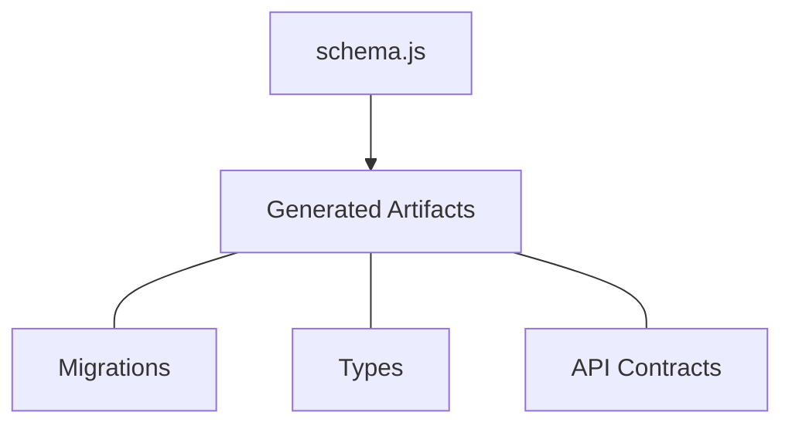

<p align="center">
    
</p>

<h1 align="center">AstrolaDB (alab)</h1>

<div align="center">
    <p>
        <strong>One schema: many languages.</strong>
    </p>
    <p>
        Define once in JavaScript then export strongly typed models.
    </p>
</div>

<p align="center">
    <a href="https://github.com/hlop3z/astroladb/actions/workflows/ci.yml"></a>
    <a href="https://goreportcard.com/report/github.com/hlop3z/astroladb"></a>
    <a href="LICENSE"></a>
</p>

<p align="center">
    <a href="https://github.com/hlop3z/astroladb/releases"></a>
    
    
</p>

<p align="center">
    <a href="https://hlop3z.github.io/astroladb/">Documentation</a>
</p>

---

Welcome to **AstrolaDB** aka `alab`. A schema orchestration tool with
**multi-language** code generation. It produces `types` and database `migrations` then **it
gets out of the way**.

**No ORM. No framework lock-in. Just clean migrations and type exports.**

Languages: **Rust** | **Go** | **Python** | **TypeScript**



---

## Core Principles

| Principle                  | What it means                                               |
| -------------------------- | ----------------------------------------------------------- |
| **Schema-First**           | Define intent once; outputs are deterministic and diff-able |
| **Single Source of Truth** | One schema drives migrations, types, and API specs          |
| **Language-Agnostic**      | One schema → multiple language projections                  |
| **No Runtime Lock-In**     | Framework-agnostic. Generates contracts, not hidden logic   |

---

## Quick Start

**Install**

```bash
curl -fsSL https://raw.githubusercontent.com/hlop3z/astroladb/main/install.sh | sh
```

**Initialize project**

```bash
alab init
```

**Create a table schema**

```bash
alab table auth user
```

**Edit your schema**

```js
// schemas/auth/user.js
export default table({
  id: col.id(),
  email: col.email().unique(),
  username: col.username().unique(),
  password: col.password_hash(),
  is_active: col.flag(true),
}).timestamps();
```

**Generate migration**

```bash
alab new create_users
```

**Apply migration**

```bash
alab migrate
```

**Export types**

```bash
alab export -f all
```

## Live Server

**The live server provides instant API exploration with automatic hot reloading.**

```bash
alab http
```

[See the full documentation →](https://hlop3z.github.io/astroladb/)

---

<p align="center">
  
  
  
</p>

---

## License

BSD-3-Clause
