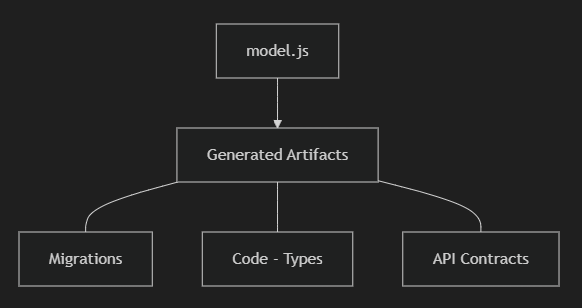
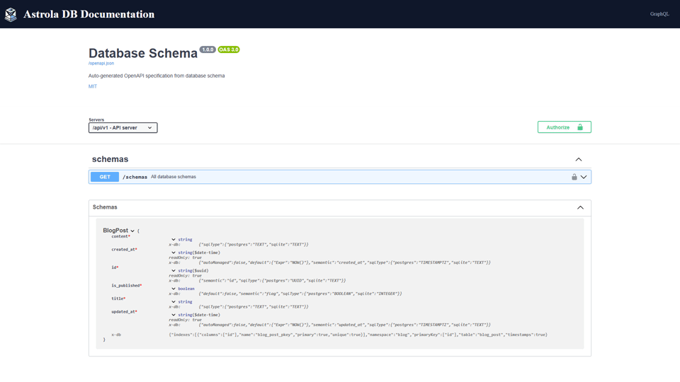
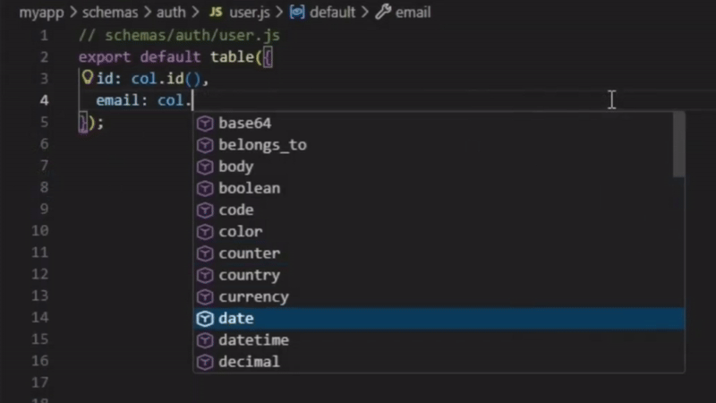

<p align="center">
  
</p>

<h1 align="center">AstrolaDB (alab)</h1>

<p align="center">
    <a href="https://github.com/hlop3z/astroladb/actions/workflows/ci.yml"></a>
    <a href="https://goreportcard.com/report/github.com/hlop3z/astroladb"></a>
    <a href="https://github.com/hlop3z/astroladb/releases"></a>
    
</p>

<p align="center">
  <strong>One schema: many languages.</strong>
</p>

<p align="center">
  <a href="https://hlop3z.github.io/astroladb/">Documentation</a> |
  <a href="https://hlop3z.github.io/astroladb/comparison/">Comparison</a> |
  <a href="https://hlop3z.github.io/astroladb/exports/">Generated-Code</a> |
  <a href="https://hlop3z.github.io/astroladb/commands/">Commands</a> |
  <a href="https://hlop3z.github.io/astroladb/cols/semantics/">Fields</a>
</p>

<p align="center">
  
</p>

---

**AstrolaDB** is a **schema-as-code** orchestration tool for **one-to-many, multi-language** code generation.

> **No Node.js. No runtime lock-in.**
> A single, portable binary.

Define your schema once in **constrained JavaScript** — a typed, executable "`JSON`" with type safety, **autocomplete**, and **IDE support**.

From the same schema, **generate**:

**SQL** migrations, **Rust** structs, **Go** models, **Python** classes, **TypeScript** types, **GraphQL** schemas, and **OpenAPI** specs.

---

## Key Highlights

- **Single ~8 MB static binary**
- **Zero dependencies**, no external runtimes
- Fast, portable, and **CI/CD-friendly**
- Works **without** JVM, Node.js, or Python

---

## Download Release

[](https://github.com/hlop3z/astroladb/releases/latest/download/alab-windows-amd64.zip)
[](https://github.com/hlop3z/astroladb/releases/latest/download/alab-darwin-amd64.tar.gz)
[](https://github.com/hlop3z/astroladb/releases/latest/download/alab-darwin-arm64.tar.gz)
[](https://github.com/hlop3z/astroladb/releases/latest/download/alab-linux-amd64.tar.gz)
[](https://github.com/hlop3z/astroladb/releases/latest/download/alab-linux-arm64.tar.gz)

---

## Install

```bash
curl -fsSL https://raw.githubusercontent.com/hlop3z/astroladb/main/install.sh | sh
```

## Quick Start

**Initialize project**

```bash
alab init
```

**Create a table schema**

```bash
alab table auth user
```

**Edit your schema**

```js
// schemas/auth/user.js
export default table({
  id: col.id(),
  email: col.email().unique(),
  username: col.username().unique(),
  password: col.password_hash(),
  is_active: col.flag(true),
}).timestamps();
```

**Generate migration**

```bash
alab new create_users
```

**Apply migration**

```bash
alab migrate
```

**Export types**

```bash
alab export -f all
```

---

## Features 🎸

**Alab** gives you **a lab** to play, explore and design your schemas.

| Feature                     | Description                                                                      |
| --------------------------- | -------------------------------------------------------------------------------- |
| **Unified Source of Truth** | Centralized schemas prevent drift between **database** and **application** code. |
| **Multi-Language Export**   | Generates **type-safe models** for multiple target languages.                    |
| **Schema Orchestration**    | Manages **SQL migrations** from generation to deployment.                        |
| **Embedded Engine**         | Executes `.js` schemas via Goja inside a **standalone Go binary**.               |
| **Live Development**        | Built-in HTTP server (`alab live`) with instant reloads.                         |
| **OpenAPI Integration**     | Exports `openapi.json` for **25+ languages** via Quicktype.                      |
| **Logical Namespacing**     | Groups tables (e.g. `auth.user`) to **avoid naming collisions**.                 |
| **Native Outputs**          | Produces **SQL** and **language-native types**.                                  |

## Live Server

Instant API exploration with automatic hot reloading:

```bash
alab live
```

---

<p align="center">
  
  
  
</p>

---

## Experimental Status

AstrolaDB is actively evolving. Current stability:

### Migrations — **Experimental**

The migration engine is **not yet battle-tested** for large-scale production.

- Migration logic is still evolving
- APIs may change and introduce breaking updates

Use caution when applying migrations directly to production systems.

### Code Generation — **Stable**

Schema orchestration and type generation are safe for development workflows.

- `alab export` generates types for Rust, Go, Python, and TypeScript
- Does **not** modify live databases

> **Recommendation:** Always validate generated SQL and test migrations in staging before production use.

---

## License

BSD-3-Clause
