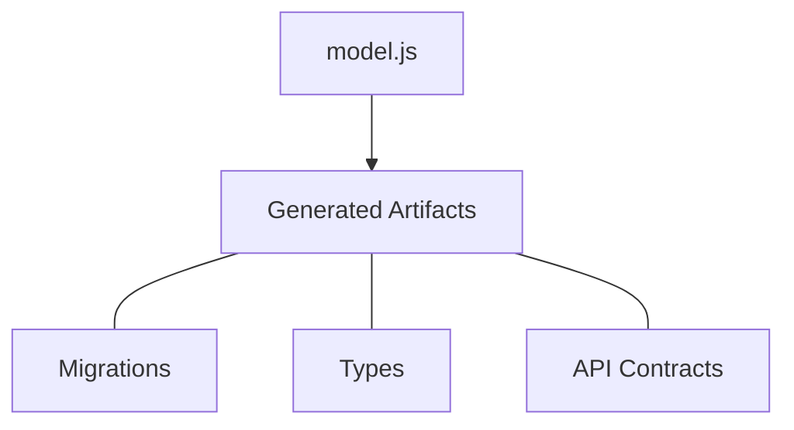

<p align="center">
    
</p>

<h1 align="center">AstrolaDB (alab)</h1>

<div align="center">
    <p>
        <strong>One schema: many languages.</strong>
    </p>
    <p>
        Define once in JavaScript then export strongly typed models.
    </p>
</div>

<p align="center">
    <a href="https://github.com/hlop3z/astroladb/actions/workflows/ci.yml"></a>
    <a href="https://goreportcard.com/report/github.com/hlop3z/astroladb"></a>
    <a href="LICENSE"></a>
</p>

<p align="center">
    <a href="https://github.com/hlop3z/astroladb/releases"></a>
    
    
</p>

<p align="center">
    <a href="https://hlop3z.github.io/astroladb/">Documentation</a>
</p>

---

Welcome to **AstrolaDB** aka `alab`. A schema orchestration tool with
**multi-language** code generation. It produces `types` and database `migrations`
then **it gets out of the way**. Including: **GraphQL** schemas and **OpenAPI**
specifications.

> No ORM. No framework lock-in. Just **clean migrations and type exports**.

## Install

```bash
curl -fsSL https://raw.githubusercontent.com/hlop3z/astroladb/main/install.sh | sh
```

---

## Key Highlights

- **Lightweight & Portable**
- Zero-dependency, **single binary (~8 MB)**
- Fast, portable, and CI/CD-friendly
- No heavy runtimes (JVM | Node.js | Python)
- Types: **Rust** | **Go** | **Python** | **TypeScript**



---

## Experimental Status

**AstrolaDB** is actively under development. Please review the current feature stability:

### 1. Migrations: **Experimental**

The migration engine is **not yet battle-tested** in large-scale production. Use `alab migrate` with caution:

- **Stability:** Migration logic is evolving and hasn't undergone extensive stress testing.
- **API Changes:** The migration API may change, potentially introducing breaking changes.

### 2. **Code Generation**: Stable

Schema orchestration and type generation are **safe for development**:

- `alab export` produces types for **Rust, Go, Python, and TypeScript** without touching your live database.
- **Recommended for development workflows**. For production, review generated SQL and verify migrations manually.

> **Note:** Always validate migrations in a staging environment before applying to production.

---

## Features 🎸

**Alab** acts as a database instrument, giving you **a
lab** to play, explore and design your schemas.

| Feature                     | Concept     | Technical Capability                                                  |
| --------------------------- | ----------- | --------------------------------------------------------------------- |
| **Unified Source of Truth** | Lead Singer | Centralizes schemas in **JavaScript**, preventing database/app drift. |
| **Multi-Language Export**   | Instruments | Generates **type-safe** Rust, Go, Python, and TypeScript structures.  |
| **Live Development**        | Sound Check | Built-in HTTP server (`alab live`) for instant schema previews.       |
| **Embedded Engine**         | -           | Runs `.js` schemas via Goja in a standalone **Go binary**.            |
| **Schema Orchestration**    | -           | Manages **SQL migrations** from generation to deployment.             |
| **OpenAPI Integration**     | -           | Exports `openapi.json` for **25+ languages** via Quicktype.           |
| **Logical Namespacing**     | -           | Groups tables (`auth.user`) to avoid naming collisions.               |
| **Runtime Independence**    | -           | Produces **SQL** and **native types**.                                |

## Live Server

**The live server provides instant API exploration with automatic hot reloading.**

```bash
alab live
```

---

<p align="center">
  
  
  
</p>

---

## Quick Start

**Initialize project**

```bash
alab init
```

**Create a table schema**

```bash
alab table auth user
```

**Edit your schema**

```js
// schemas/auth/user.js
export default table({
  id: col.id(),
  email: col.email().unique(),
  username: col.username().unique(),
  password: col.password_hash(),
  is_active: col.flag(true),
}).timestamps();
```

**Generate migration**

```bash
alab new create_users
```

**Apply migration**

```bash
alab migrate
```

**Export types**

```bash
alab export -f all
```

## License

BSD-3-Clause
