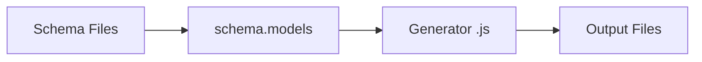

import { Aside } from "@astrojs/starlight/components";

**`alab gen`** lets you write JavaScript functions that transform your schema
into any output — Python models, REST routers, GraphQL resolvers, Terraform
configs, or anything else you can express as text files.

## How It Works



1. Alab loads your schema and builds a `schema` object with `models` and
   `tables`.
2. Your generator receives that object inside `gen()`.
3. You return a `render({...})` call mapping file paths to string contents.
4. Alab writes the files to disk.

## API

Every generator is a single `.js` file:

```js
export default gen((schema) =>
  render({
    "models.py": buildModels(schema),
    "router.py": buildRouter(schema),
  }),
);
```

| Function                   | Description                                                    |
| -------------------------- | -------------------------------------------------------------- |
| `gen(fn)`                  | Entry point. Receives a callback with the schema.              |
| `render({path: string})`   | Output. Maps relative file paths to string contents.           |
| `perTable(schema, fn)`     | Helper. Iterates `schema.tables`, merges results.              |
| `perNamespace(schema, fn)` | Helper. Iterates `schema.models` by namespace, merges results. |
| `json(value, indent?)`     | Helper. Safe `JSON.stringify` wrapper.                         |
| `dedent(str)`              | Helper. Strips common leading whitespace.                      |

### Schema Object

Inside `gen()`, `schema` is a **deeply frozen** (immutable) object:

| Field           | Type     | Description                                     |
| --------------- | -------- | ----------------------------------------------- |
| `schema.models` | `object` | Tables grouped by namespace: `{ ns: table[] }`. |
| `schema.tables` | `array`  | Flat array of all tables across namespaces.     |

### Accessing Tables

```js
// schema.models is { namespace: [table, ...] }
const namespaces = Object.keys(schema.models);
const authTables = schema.models["auth"];

// or iterate all tables directly
for (const table of schema.tables) {
  console.log(table.name);
}
```

Each table object has:

```js
{
  name: "user",
  table: "auth_user",
  primary_key: "id",
  timestamps: true,
  columns: [
    { name: "id", type: "uuid" },
    { name: "username", type: "string", unique: true },
    { name: "role", type: "enum", enum: ["admin", "editor", "viewer"], default: "viewer" },
    // ...
  ]
}
```

## CLI

### Run a Generator

```bash
alab gen run <file> -o <output_dir>
```

The `.js` extension is optional:

```bash
alab gen run generators/fastapi -o ./generated
```

| Flag           | Description                     |
| -------------- | ------------------------------- |
| `-o, --output` | **Required.** Output directory. |

### Download a Shared Generator

```bash
alab gen add <url>
```

Downloads the file to `generators/` in your project root:

```bash
alab gen add https://raw.githubusercontent.com/hlop3z/astroladb/main/examples/generators/generators/fastapi.js
```

This saves `generators/fastapi.js`. If the file already exists, use `--force`:

```bash
alab gen add --force <url>
```

<Aside type="tip">
Generators are just single `.js` files — host them anywhere (GitHub, a gist,
your own server) and share with `alab gen add <url>`.
</Aside>

## Example: FastAPI Generator

A full working example lives at
[**examples/generators**](https://github.com/hlop3z/astroladb/tree/main/examples/generators)
on GitHub.

From a single schema file, the FastAPI generator produces:

| File               | Contents                                           |
| ------------------ | -------------------------------------------------- |
| `auth/models.py`   | Pydantic models with enums, defaults, `Optional`   |
| `auth/router.py`   | CRUD endpoints (list, get, create, update, delete) |
| `auth/__init__.py` | Re-export                                          |
| `main.py`          | FastAPI app wiring all routers                     |

### Try It

```bash
# 1. Generate the code
alab gen run generators/fastapi -o ./generated

# 2. Install dependencies and run
cd generated
uv add fastapi[standard]
uv run fastapi dev main.py

# 3. Open http://localhost:8000/docs
```

## Writing Your Own Generator

Start from the pattern:

```js
export default gen((schema) => {
  const files = {};

  for (const [ns, tables] of Object.entries(schema.models)) {
    for (const table of tables) {
      files[`${ns}/${table.name}.txt`] = `Table: ${table.table}`;
    }
  }

  return render(files);
});
```

### Rules

<Aside type="caution">
- **Pure functions.** No filesystem, network, `eval`, or `Date.now()`.
- **Strings only.** Every value in `render({...})` must be a string.
- **Relative paths only.** No `..`, no absolute paths, no dotfiles.
</Aside>

### Sandbox Constraints

Generators run inside a sandboxed JavaScript runtime:

| What's blocked             | Why                                    |
| -------------------------- | -------------------------------------- |
| `require` / `import`       | No Node modules.                       |
| `fetch` / `XMLHttpRequest` | No network access.                     |
| `eval` / `Function()`      | No code injection.                     |
| `async` / `Promise`        | No async — keeps output deterministic. |
| `process` / `env`          | No environment leaks.                  |
| Prototype mutation         | All prototypes frozen.                 |

Execution timeout: **5 minutes**. Max output: **500 MB**, **10,000 files**.

<Aside type="note">Same schema + same generator = same output, always.</Aside>
