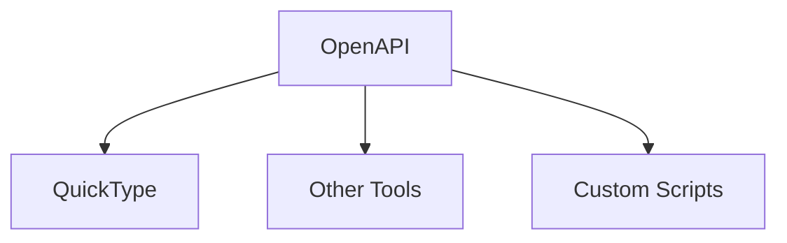

import { Aside } from "@astrojs/starlight/components";

Welcome back to another jam session: **Advanced Workflows.**

If you read the introduction you learned that `model.js` are the leader singers
of **alab**. In the following section you we are going to take a tour to the
backstage and take this from a **band** to an **orchestra**.

## OpenAPI (V3)

OpenAPI is the language of the internet. Within Alab, it serves as the
**conductor**, orchestrating every section to play in sync.

By using v3 extensions AstrolaDB includes `x-db` fields in your
**Model(`Table`)** and **Fields(`Columns`)**. These extensions turn a standard
OpenAPI spec into a **complete database blueprint** that any tool, language or
framework can consume.

## What `x-db` Gives You

At the **schema level** (per table), `x-db` carries:

| Field           | Type       | Description                                              |
| --------------- | ---------- | -------------------------------------------------------- |
| `table`         | `string`   | Fully qualified table name (e.g. `auth_user`)            |
| `namespace`     | `string`   | Schema namespace (e.g. `auth`)                           |
| `primary_key`   | `string[]` | Primary key column(s)                                    |
| `timestamps`    | `boolean`  | Whether the table has `created_at` / `updated_at`        |
| `soft_delete`   | `boolean`  | Whether the table uses `deleted_at`                      |
| `auditable`     | `boolean`  | Whether the table tracks `created_by` / `updated_by`     |
| `sort_by`       | `string[]` | Default `ORDER BY` columns for queries                   |
| `searchable`    | `string[]` | Columns marked for full-text search indexing             |
| `filterable`    | `string[]` | Columns available for query filtering                    |
| `indexes`       | `object[]` | Index definitions (unique, composite, primary)           |
| `join_table`    | `object`   | Join table metadata (only on many-to-many tables)        |
| `relationships` | `object`   | Relationship map (`has_one`, `has_many`, `many_to_many`) |

At the **property level** (per column), `x-db` carries:

| Field          | Type      | Description                                                                               |
| -------------- | --------- | ----------------------------------------------------------------------------------------- |
| `sql_type`     | `object`  | Native SQL type per dialect (`postgres`, `sqlite`)                                        |
| `semantic`     | `string`  | Column role hint (`id`, `username`, `flag`, etc.)                                         |
| `default`      | `any`     | Default value or expression (e.g. `{"postgres": "NOW()", "sqlite": "CURRENT_TIMESTAMP"}`) |
| `auto_managed` | `boolean` | Whether adapters must manage this column                                                  |
| `generated`    | `boolean` | Whether the value is auto-generated (e.g. UUID id)                                        |
| `ref`          | `string`  | Referenced table name                                                                     |
| `fk`           | `string`  | Full foreign key path (e.g. `auth_user.id`)                                               |
| `on_delete`    | `string`  | Referential action on delete (e.g. `CASCADE`)                                             |
| `on_update`    | `string`  | Referential action on update                                                              |
| `relation`     | `string`  | Relationship name derived from the column                                                 |
| `inverse_of`   | `string`  | Inverse relationship (source table name)                                                  |
| `virtual`      | `boolean` | Whether this is a computed/virtual column                                                 |
| `computed`     | `object`  | Computed column expression                                                                |
| `polymorphic`  | `object`  | Polymorphic relationship metadata                                                         |

## More Than Documentation

Most tools use OpenAPI just for documentation. AstrolaDB uses it as a **Rich
Metadata Manifest**. By embedding `x-db` tags into the standard OpenAPI spec, it
creates a **portable brain** of your database — **types, constraints,
relationships, indexes, and SQL details** all in one file.

Since almost every language on earth speaks `JSON`, your automation is truly
portable. AstrolaDB is essentially a **Metadata Factory** that feeds the rest of
your ecosystem:

- **Generate typed clients:** in any language with
  [QuickType](https://quicktype.io); `x-db` extensions stay intact.
- **Build custom adapters:** ORM, REST, or GraphQL from a single JSON.
- **Automate infrastructure:** CI, migration checks, and docs all parse the same
  spec.
- **Feed AI agents:** LLMs or code generators understand your entire DB without
  source access.

<Aside type="tip">
  Even if you stop using AstrolaDB, that JSON file can be read by Python
  scripts, custom Rust generators, or whatever comes next — **forever**. If the
  band breaks up, you keep the code.
</Aside>
