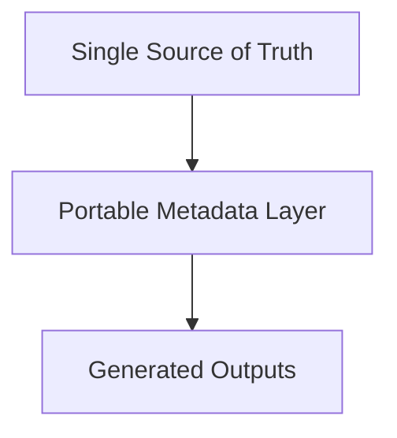

import { Aside } from "@astrojs/starlight/components";

<Aside type="note">
  This page covers the architectural reasoning behind AstrolaDB's design
  decisions. It is not required reading for day-to-day usage — see [Quick
  Start](../../quick-start/) for that.
</Aside>

Modern backend stacks are composed of **good tools**: ORMs, migration
frameworks, API specifications — but they share a common structural assumption:
**engineers are responsible for keeping them consistent**.

This page describes an alternative approach — one where consistency is an
engineering property of the system, **not a workflow convention**.

---

## The Integration Model

**Pattern:** Compose independent tools and keep them aligned manually.

**Typical stack**

- **ORM** (Prisma, TypeORM, Drizzle, etc.)
- **Migration** tool (Flyway, Liquibase, Knex)
- **API specification** (generated after implementation or handwritten OpenAPI)

**Architecture**

- Multiple sources of truth, each with its own schema language and lifecycle
- Developers serve as the synchronization mechanism between them

**Structural properties**

- Drift is not a defect — it is an emergent property of the architecture
- Correctness depends on discipline, code review, and institutional knowledge
- The system is one missed update away from inconsistency

### The inherent challenge

These are excellent tools — each solves real problems well. But they all face a
shared structural challenge: **inferring intent from state changes is
fundamentally hard**.

<Aside type="note">
  No diff engine can reliably distinguish a column rename from a (`drop`+`add`).
  Autogenerate tools [require manual
  review](https://alembic.sqlalchemy.org/en/latest/autogenerate.html) because
  inference has limits. Schema sync features that **skip migration files trade
  history and auditability for speed**. Drift detection mechanisms like [shadow
  databases](https://www.prisma.io/docs/orm/prisma-migrate/understanding-prisma-migrate/shadow-database)
  add operational complexity.
</Aside>

None of this is a deficiency in any individual tool — it is a consequence of the
integration model itself. When multiple representations of the same system
exist, keeping them aligned requires inference, and inference has edges.

---

## The Orchestration Model

**Pattern:** Define the system once. Generate everything else.

**How it works**

- A single declarative schema
- A build step transforms it into:
  - A portable metadata layer (OpenAPI + extension annotations)
  - Generated artifacts (SQL, typed clients, documentation)

**Architecture**



**Structural properties**

- All artifacts are projections of the same model
- Consistency is enforced by the system, not by the team

---

## Why OpenAPI v3 + One Extension

OpenAPI v3 provides:

- A well-defined **type system** (objects, arrays, enums, nullability)
- Field-level **constraints** (required, formats, ranges)
- A **mature tooling** ecosystem (validators, parsers, diff tools)
- A **shared mental model** across backend, frontend, infra, and tooling

By embedding the data model in OpenAPI, AstrolaDB is **not inventing a new
schema language** that only one tool understands.

### Extension granularity

All non-HTTP concerns — DB constraints, relations, indexes, ownership — live in
a single `x-db` namespace. This follows the
[OpenAPI extension best practice](https://swagger.io/docs/specification/v3_0/openapi-extensions/)
of using a vendor prefix (`x-db`) so that standard parsers
[ignore it without error](https://apihandyman.io/writing-openapi-swagger-specification-tutorial-part-9-extending-the-openapi-specification/).

Consumers either understand the extension or skip it entirely without breaking
the base spec. That is exactly how OpenAPI extensions are
[designed to work](https://github.com/OAI/OpenAPI-Specification/discussions/4989).

This is very different from:

- Spreading semantics across comments or naming conventions
- Maintaining parallel schema formats that must stay synchronized
- Inventing a proprietary IDL that locks users into one ecosystem

---

## Honest Constraints

The orchestration model's guarantees rest on specific properties.

### Semantic completeness

To claim structural drift is eliminated, the extension must capture:

- Relational semantics (FKs, cardinality, ownership)
- Constraints (uniqueness, checks, nullability beyond OpenAPI's surface)
- Domain invariants that are not HTTP-shaped

### Extension discipline

If the extension becomes "whatever metadata we might need someday" — a loose bag
of flags interpreted differently by generators — then you drift back toward
implicit semantics in a different file.

Strong systems prefer fewer concepts, with strict meaning, and deterministic
downstream interpretation.

### OpenAPI's HTTP bias

OpenAPI is HTTP-centric by origin. That is fine as long as:

- DB semantics are not forced to look like request/response shapes
- The tool is not constrained by REST assumptions

AstrolaDB uses OpenAPI as a carrier, not a limiter.

---

## Declarative Model vs Migration History

### Why they are separate

| Aspect        | Declarative Model              | Procedural Migrations |
| ------------- | ------------------------------ | --------------------- |
| Purpose       | What the system _is_           | How it _changed_      |
| Stability     | High                           | Low                   |
| Consumers     | Code generators, tools, humans | DB engines            |
| Reversibility | Yes (regenerate)               | Often no              |

The declarative model describes the **desired present state** — the
authoritative structure of the data now.

Migrations describe **how you got here** — irreversible, time-ordered
transformations with operational intent (backfills, data fixes, conditional
logic).

Trying to collapse those into one artifact is usually a mistake. Separating them
is not a weakness — it is a recognition of reality.

### What drift elimination actually means

**Eliminated by design:**

- Drift between API types, generated models, and generated SQL
- Inconsistencies caused by manually editing multiple schema representations

<Aside type="caution" title="Not eliminated (and cannot be in any system)">
  - Logical errors inside migrations - Data-quality mistakes during transitions
  - Operational mistakes (running migrations out of order, partial deploys)
</Aside>

The honest claim:

> **Structural drift across services and languages is eliminated by
> construction. Temporal risk remains.**

### Different tools, different trade-offs

Most ORMs couple the declarative model to a migration engine and use inference
to bridge the gap — comparing model state against database state to generate
migration candidates. This is pragmatic and works well in many contexts, but it
means the migration engine must guess intent (renames vs drops, type coercions,
constraint changes).

AstrolaDB takes a different position: the declarative model is authoritative,
and migrations are explicit, human-authored programs. The tool never infers
migration steps — it generates downstream artifacts (types, API specs, code) but
leaves schema evolution to the developer. This trades convenience for
predictability.

---

## Comparison by Dimension

### Correctness

- **Integration:** Human-enforced across multiple representations
- **Orchestration:** Machine-enforced from a single source
- **Effect:** Schema and type mismatch is eliminated as a class of defects

### Change Cost

- **Integration:** Coordinated multi-file edits across tools
- **Orchestration:** Regenerate all artifacts from the source definition
- **Effect:** Changes propagate automatically; fewer files to touch

### System Comprehension

- **Integration:** Fragmented across disconnected tool-specific representations
- **Orchestration:** One model that describes the full system
- **Effect:** The system definition is always complete, current, and inspectable

### Technology Coupling

- **Integration:** Tied to specific ORMs, languages, and runtimes
- **Orchestration:** Downstream consumers are replaceable
- **Effect:** Technology decisions become reversible without schema rework

### Automation Surface

- **Integration:** Tool-specific integrations, brittle across versions
- **Orchestration:** Universal, metadata-driven
- **Effect:** CI pipelines, compliance auditing, and code generation all read
  from the same source

---

## The Core Observation

Most tools address the question:

> _How do we make it easier to write and maintain these artifacts?_

The orchestration model addresses a different question:

> _Why are we expressing the same conceptual entity multiple times at all?_

When the second question is answered, the first stops applying.

---

## Meta-programming as a First-Class Capability

When a system has a single authoritative model, a natural consequence follows:
**anything that can be derived from that model can be generated**.

This is **meta-programming** — writing **programs that produce programs**.
AstrolaDB already uses this internally: SQL migrations, OpenAPI specs, GraphQL
SDL, and typed clients are all **projections of the same schema**. But the same
capability is available to users through `alab gen`.

### Custom projections via `alab gen`

For anything else — FastAPI routers, Terraform configs, protobuf definitions,
internal documentation, test fixtures — you write a
[generator](/advanced_users/generators/): a JavaScript function that receives
the schema and returns files.

```js
export default gen((schema) => {
  const files = {};
  for (const [ns, tables] of Object.entries(schema.models)) {
    // Build whatever you need from the schema
  }
  return render(files);
});
```

This is the **escape hatch**. AstrolaDB **cannot anticipate every downstream
format, but it can guarantee that any generator you write operates on the same
authoritative model as everything else**. The single source of truth extends to
your custom tooling, not just the built-in outputs.

---

## Summary

- The tool does **not** magically eliminate all risk
- It does **not** make migrations trivial
- It **does** eliminate an entire class of cross-artifact inconsistencies
- It **does** centralize the most important invariant: what the system is
  supposed to look like

AstrolaDB does not invent a new modeling language. It treats OpenAPI as a
transport for system semantics, and enforces all non-HTTP meaning in a single,
explicit extension. That is what allows consistency to be enforced by
construction rather than convention.

<Aside type="note">
  The migration system follows a familiar pattern (similar to Alembic): named
  revisions with explicit up and down functions
</Aside>
