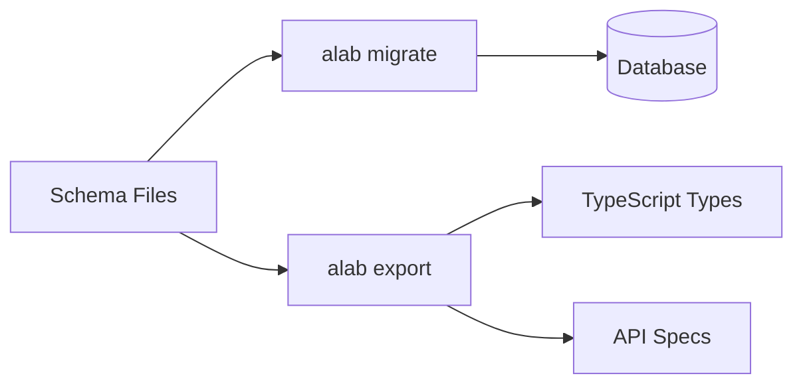

Astroladb follows a simple principle: **define once, generate everything**.

## The Core Flow



Your `.js` schema files are the single source of truth. From them, Astroladb
generates:

| Command                     | Output         | Purpose              |
| --------------------------- | -------------- | -------------------- |
| `alab migrate`              | SQL migrations | Update your database |
| `alab export -f typescript` | `.ts` files    | Type-safe code       |
| `alab export -f openapi`    | `openapi.yaml` | API documentation    |

## Schema to Migration

Define your data model:

```js
// schemas/blog/post.js
export default table({
  id: col.id(),
  title: col.title(),
  content: col.body(),
  published: col.flag(false),
}).timestamps();
```

Run migration:

```bash
alab new create_posts
alab migrate
# → migrations/001_create_posts.sql generated
# → Applied to database
```

## Schema to Types

Export TypeScript types from the same schema:

```bash
alab export -f typescript
```

```typescript
// types/blog/post.ts (generated)
export interface Post {
  id: string;
  title: string;
  content: string;
  published: boolean;
  created_at: Date;
  updated_at: Date;
}
```

## One Schema, Many Outputs

The key insight: **your schema is not tied to any single output format**.

```
post.js
    ├── PostgreSQL table
    ├── TypeScript interface
    ├── Go struct
    ├── Python dataclass
    ├── OpenAPI schema
    └── GraphQL types
```

Change your schema once, regenerate everything. No manual sync required.
