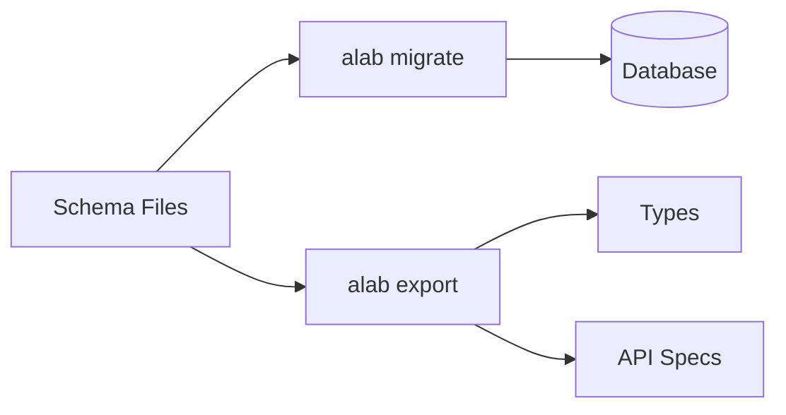

import { Image } from "astro:assets";

import MusicPNG from "../../assets/music.png";
import MyBandPNG from "../../assets/my_band.gif";

Welcome to **AstrolaDB** aka `alab`. A schema-first database orchestration tool
with multi-language codegen.

**One** schema: **many** languages.

```js
export default table({
  id: col.id(),
  username: col.username().unique(),
  password: col.password_hash(),
});
```

**Rust** | **Go** | **Python** | **TypeScript**

## What is AstrolaDB?

**AstrolaDB** is a migrations tool. It lets you design your database `schemas`
and `migrations` using **JavaScript**. It includes a built-in JavaScript engine
powered by **Goja**.

Your `.js` schema files are the **single source of truth**:

| Command                     | Output           | Purpose              |
| --------------------------- | ---------------- | -------------------- |
| `alab migrate`              | `SQL` migrations | Update your database |
| `alab export -f typescript` | `.ts` files      | Type-safe code       |
| `alab export -f openapi`    | `openapi.json`   | API documentation    |

## Who Is This Tool For?

- **Polyglot developers**
- **Polyglot teams**

It allows you to define schemas once and export **strongly-typed
representations** to multiple languages, reducing duplication and drift. You can
start prototyping in Python, then move to Rust or Go or vice versa. However,
**the schema remains the constant**.

## Why Alab?

The name is a play on **"Astrolabe"**, an ancient astronomical instrument. In
this case, **Alab** acts as a database instrument 🎹🎸, giving you **a
lab**oratory to play, explore and design your schema.

## Why Postgres and SQLite

I chose to support only these two databases because they cover 3 tiers:

- **SQLite**: embedded, local development, and small-scale use cases
- **Postgres**: most standard application needs
- **CockroachDB**: when a multi-region Postgres setup is required

## Why Go?

**Go** was chosen for its ease of use, portability, and ability to compile to
binaries. This ensures AstrolaDB can run efficiently in both **development** and
**CI workflows**. Users don't need a **Node.JS** runtime to run the migrations.

## Why JavaScript?

Built with developer experience (**DX**) in mind, by using **JavaScript** to
**"trick"** the **IDE** via the included `tsconfig.json` and `.d.ts` files. It's
not meant to be a full JS utility. Think of it as a **fancy** `JSON` that lets
you declare **configurations**.

This approach gives **portability**, IDE **autocompletion**, and early **error
detection**, letting you define **semantic types** for schemas while keeping
migrations simple and explicit.

<iframe
  width="560"
  height="315"
  src="https://www.youtube.com/embed/zPvbYlxAtDk?si=M23OOPmKMAyPXugH"
  title="YouTube video player"
  frameborder="0"
  allow="accelerometer; autoplay; clipboard-write; encrypted-media; gyroscope; picture-in-picture; web-share"
  referrerpolicy="strict-origin-when-cross-origin"
  allowfullscreen
></iframe>

## The Music

<Image src={MusicPNG} alt="The Music" width="240px" />

**Imagine a band**: Python on the **drums**, Go on the **guitar**, Rust on the
**bass**, and TypeScript **singing**. Different instruments, different roles yet
is the **same song**. The notes are universal and the rhythm must be shared.

This tool makes sure everyone stays in sync. No matter who writes the notes or
lyrics, when the music plays, **each instrument hits its mark**, creating a full
song... **letting the music flow!**

## The Flow



The `schema.js` files are the **lead singers** of **Alab**.

<Image src={MyBandPNG} alt="D12: My Band" width="540px" />
